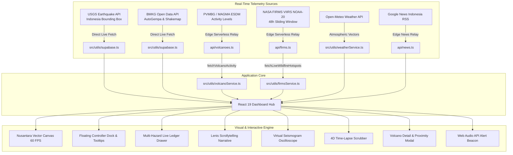

<div align="center">

# 🌍 Nusantara Crustal Observatory & Global Seismic Tracker
### *Real-Time Seismic Telemetry, NASA FIRMS Wildfire Satellite Intelligence & Volcanic Observatory*

[](https://react.dev/)
[](https://www.typescriptlang.org/)
[](https://developer.mozilla.org/en-US/docs/Web/API/Canvas_API)
[](https://vitejs.dev/)
[](https://tailwindcss.com/)
[](https://supabase.com/)
[](#-license)

<br />

<p align="center">
  A high-performance, research-grade planetary hazard monitoring observatory. Combines sub-millimeter 2D Canvas vector cartography, live USGS and BMKG earthquake telemetry, NASA FIRMS active polar-orbiting wildfire satellite feeds, official PVMBG (MAGMA ESDM) volcanic eruption telemetry, 4D time-lapse playback, multi-hazard ledger drawer, and scrollytelling data journalism across all device viewports.
</p>

</div>

---

## 🧭 Overview

**Nusantara Crustal Observatory / Global Seismic Tracker** transforms raw multi-agency geoscientific telemetry into an intuitive, high-fidelity interactive web observatory with **zero fictitious or synthetic fallback data**. Built with **React 19**, **HTML5 Canvas 2D Vector Cartography**, and **Vite**, the system visualizes planetary crustal dynamics with rigorous scientific precision:

- **High-Precision Nusantara Vector Map:** Sub-millimeter architectural 2D canvas cartography mapping the Indonesian archipelago, equatorial parallels, and Sunda Megathrust subduction trench lines with kinetic momentum panning, wheel zoom, multi-touch pinch-to-zoom, and anchored landmark coordinates at 60 FPS.
- **Seismic Telemetry (100% Real-Time):** Live USGS and Indonesian BMKG AutoGempa telemetry feeds with hypocenter depth color coding, sonar shockwave ripples, and collision-free event tags.
- **NASA FIRMS Wildfire Satellite Feed:** Real-time thermal anomaly pipeline powered by **NASA VIIRS NOAA-20** polar-orbiting satellite passes (48-hour sliding window), serving 500+ live hotspots with Fire Radiative Power (MW) metrics and regional wind vectors.
- **Volcanic Eruption Intelligence (PVMBG / MAGMA ESDM):** Synchronized alert levels directly aligned with official Geological Agency advisories (**Level III SIAGA** for Lewotobi Laki-Laki, Semeru, Merapi, Ibu, and Anak Krakatau; **Level II WASPADA** for Marapi and Ruang) with exact crater-to-city geodesic proximity calculations.
- **Multi-Hazard Live Ledger Drawer:** Full-screen mobile-first drawer featuring instant switching between **Earthquakes**, **NASA Wildfires**, and **Active Volcanoes** with advanced filters (FRP, Magnitude, Region) and one-tap camera fly-to focus.
- **Tactical Observatory Tools:** Virtual seismogram oscilloscope, official BMKG shakemaps, 7-day 4D time-lapse replay, synthesized Web Audio beacon alerts, disaster news verification (Google News RSS), and emergency broadcast social infographic generation.
- **Full Bilingual Localization:** Seamless instant toggle between Bahasa Indonesia (ID) and English (EN).

---

## ✨ Key Features

### 🗺️ 1. High-Performance Nusantara Vector Map
- **Architectural Planar Vector Cartography:** Canvas 2D rendering engine projecting high-resolution GeoJSON landmasses of Indonesia and surrounding territories at a rock-solid 60 FPS.
- **Sunda Megathrust Subduction Trench:** Crisp vector lines mapping the tectonic subduction interface where the Indo-Australian and Eurasian plates collide.
- **Smooth Inertial Navigation:** Kinetic momentum dragging, mouse wheel zoom, double-click focus, and multi-touch pinch-to-zoom for mobile devices.
- **Anchored Grounded Markers:** Telemetry coordinates and hazard markers stay pinned to geographic coordinates with zero floating drift during smooth scrollytelling transitions.

### 🌋 2. Multi-Hazard Planetary Telemetry
- **Real-Time Earthquake Feeds:** Automated USGS ingestion pipeline coupled with live Indonesian BMKG AutoGempa telemetry. Zero mock/synthetic events.
- **Active Volcano Telemetry (PVMBG - MAGMA Indonesia):** Real-time monitoring of active Indonesian volcanoes with officially verified alert levels:
  - **Gunung Lewotobi Laki-Laki (NTT):** Officially **Level III (Siaga)** with 5 km hazard radius and crater steam/ash emissions.
  - **Gunung Marapi (Sumbar):** Officially **Level II (Waspada)** with 3 km hazard radius from Verbeek Crater.
  - **Gunung Merapi, Semeru, Ibu, Anak Krakatau:** Officially **Level III (Siaga)**.
  - **Gunung Ruang:** Officially **Level II (Waspada)**.
- **Geodesic Crater Proximity Calculator:** Built-in Haversine proximity engine calculating live safety radius and direct distance from the volcano's actual crater to 50+ Indonesian benchmark cities or user's live GPS coordinates.
- **NASA FIRMS Wildfire Integration:** Real-time satellite pipeline streaming active VIIRS NOAA-20 thermal anomalies with Fire Radiative Power (MW), confidence grading, and regional categorization (Kalimantan, Sumatra, Sulawesi, Papua, Jawa).
- **Multi-Mode Controller Dock:** Switch seamlessly between **Dual Hazard**, **Seismic Only**, **Wildfire Only**, or **Volcano Only** visualization modes.

### 📑 3. Multi-Hazard Live Ledger Drawer
- **Unified Hazard Feed:** Instant slide-over drawer organizing all active disasters across Nusantara into three dedicated tabs:
  - **🌋 GEMPA:** Filter by All, M5.0+, Major M6.0+, or Saved Bookmarks.
  - **🔥 TITIK API (NASA FIRMS):** Live 500+ satellite hotspots filterable by FRP (&ge;50 MW, &ge;120 MW Ekstrem) and island (Kalimantan, Sumatra).
  - **▲ GUNUNG API (PVMBG):** 7 prominent active volcanoes with official alert level badges, elevations, and danger radiuses.
- **Interactive Fly-To Navigation:** Clicking any hazard row in the drawer automatically flies the 3D globe camera directly to the exact coordinates and displays its inspection card.
- **Mobile-First Responsiveness:** Native full-bleed layout on mobile phones, notch & home bar safe-area insets (`env(safe-area-inset)`), and iOS Safari zoom prevention.

### 🇮🇩 4. BMKG AutoGempa & Shakemap Visualizer
- Direct integration with Indonesia's Meteorology, Climatological, and Geophysical Agency (BMKG).
- **Dynamic Island Style Mobile Capsule:** Compact, beautifully rounded mobile capsule displaying current epicenter telemetry, magnitude badge, and rapid detail expander.
- **BMKG Shakemap Modal:** Official shakemaps, Modified Mercalli Intensity (MMI) felt scales, hypocenter depth, coordinates, and tsunami potential warnings.
- **20-20-20 Coastal Evacuation Protocol:** Integrated public education guideline (20 seconds of strong shaking &rarr; 20 minutes to evacuate &rarr; 20 meters above sea level).

### 🔍 5. Disaster News & Verification Feed
- Live natural disaster intelligence relay connected to **Google News Indonesia RSS**, indexing verified emergency reporting from BNPB, BPBD, BMKG, and national press.
- Provides immediate situational awareness and debunking of viral disaster hoaxes.

### 📜 6. Scrollytelling & Dynamic Narrative Rail
- **Lenis Smooth Scroll:** Hardware-accelerated smooth scrolling transitioning seamlessly from the Hero display into in-depth data journalism chapters.
- **Algorithmic Chapter Analytics:** Dynamic clustering engine (`storyAnalytics.ts`) automatically detecting high-magnitude swarms, megathrust strain, and deep mantle subduction events.
- **Story Progress Rail:** Visual chapter indicator tracking reading progress and synchronizing map view coordinates with each region under investigation.

### ⏱️ 7. 4D Time-Lapse Seismic Chrono-Scrubber
- 7-day chronological playback simulator with scrub bar and interactive play/pause controls.
- Dynamic speed multipliers (**1x**, **5x**, **15x**, **45x**) allowing researchers to observe foreshock and aftershock sequences over time.

### 📈 8. Virtual Seismogram Oscilloscope
- Interactive educational waveform generator modeling P-wave and S-wave arrival times based on epicentral distance to real BMKG broadband seismic stations (LEM Lembang, DNP Denpasar, RTG Ruteng, BND Banda, etc.).

### 🚨 9. Audio Beacon Alerts & Social Emergency Infographics
- **Synthesized Audio Beacon:** Web Audio API oscillator triggering frequency-tuned sonic pings on critical seismic events (M &ge; 5.5).
- **Disaster Infographic Generator:** One-click modal generating formatted emergency broadcast visual cards for social media public safety broadcasting.
- **WhatsApp Emergency Broadcast Sharing:** Pre-formatted, human-friendly disaster bulletins for instant group safety broadcasts.

---

## 🛠️ Architecture & Data Pipeline



### Core Technologies
| Layer | Technology | Purpose |
|---|---|---|
| **Frontend Core** | React 19 + TypeScript | High-performance reactive UI with strict type safety |
| **Cartography & Rendering** | HTML5 Canvas 2D Vector Engine | Hardware-accelerated 60 FPS planar map projection, subduction lines, and thermal vectors |
| **Serverless Edge Relays** | Vercel Edge Functions (`api/`) | High-speed, CORS-free proxies for NASA FIRMS, MAGMA ESDM, and Google News feeds |
| **Motion & Smooth Scroll** | Lenis + Tailwind CSS v4 | Inertial scrollytelling, liquid-glass aesthetics, and mobile safe-area insets |
| **Icons** | Lucide React | Minimalist scientific iconography |
| **Database (Optional)** | Supabase (PostgreSQL 15+) | Managed database for persistent bookmarking and seismic archiving |
| **Geodesic Calculations** | Great-Circle Haversine Formula | Mathematical distance from physical volcanic craters to Indonesian cities |
| **External Feeds** | USGS, BMKG, PVMBG, NASA FIRMS, Open-Meteo | 100% verified real-time scientific telemetry |

---

## 🚀 Getting Started

### Prerequisites
- **Node.js**: v18.0.0 or higher
- **npm**, **pnpm**, or **yarn**

---

### 1. Clone the Repository
```bash
git clone https://github.com/FerrelHD/Global-Seismic-Tracker.git
cd Global-Seismic-Tracker
```

### 2. Install Dependencies
```bash
npm install
```

### 3. Configure Environment Variables (Optional)
Create a `.env` file in the project root if you wish to connect a custom Supabase instance or NASA FIRMS MAP_KEY:

```env
# Optional Supabase credentials
VITE_SUPABASE_URL=https://your-project-ref.supabase.co
VITE_SUPABASE_ANON_KEY=your-anon-key-here

# Optional custom NASA FIRMS Map Key (Default public relay is pre-configured)
NASA_FIRMS_MAP_KEY=your-nasa-firms-key
```

### 4. Start the Local Development Server
```bash
npm run dev
```

Open [http://localhost:3000](http://localhost:3000) in your browser. The local development environment includes built-in Vite dev server proxy plugins simulating production Edge functions for NASA FIRMS, MAGMA ESDM, and Google News.

---

## 📜 Available NPM Scripts

| Command | Action |
|---|---|
| `npm run dev` | Launches Vite dev server with proxy plugins on port 3000 |
| `npm run build` | Validates TypeScript and packages optimized production bundle into `dist/` |
| `npm run preview` | Locally previews the generated production bundle |
| `npm run sync` | Runs manual USGS seismic ingestion script to Supabase (if configured) |
| `npm run verify` | Verifies Supabase database connection and telemetry health |

---

## 📂 Project Structure

```
Global-Seismic-Tracker/
├── api/                        # Production Vercel Edge Serverless Functions
│   ├── firms.ts                # Real-time NASA VIIRS NOAA-20 satellite relay
│   ├── volcanoes.ts            # Live PVMBG / MAGMA ESDM alert level scraper
│   └── news.ts                 # Real-time Google News Indonesia disaster RSS relay
├── public/                     # Static assets
│   ├── favicon.svg             # Planetary seismic telemetry SVG favicon
│   └── data/                   # High-resolution GeoJSON cartography datasets
├── scripts/                    # Maintenance & sync scripts
│   ├── fetch-usgs.js           # Manual USGS ingestion to Supabase
│   └── verify-db.js            # Telemetry healthcheck utility
├── src/
│   ├── components/
│   │   ├── hero/               # Hero landing section & kinetic typography
│   │   │   └── HeroSection.tsx
│   │   ├── story/              # Scrollytelling story cards & progress rail
│   │   │   ├── StoryChapterCard.tsx
│   │   │   └── StoryProgressRail.tsx
│   │   └── ui/                 # Observatory HUD & tactical widgets
│   │       ├── BMKGShakemapModal.tsx        # BMKG official shakemap viewer
│   │       ├── BookmarkDrawer.tsx           # Saved bookmarks slide-over drawer
│   │       ├── DisasterNewsVerification.tsx # Disaster news verification panel
│   │       ├── EpicenterMapCard.tsx         # Dynamic Island BMKG card & evacuation guide
│   │       ├── EventModal.tsx               # Detail seismic inspection modal
│   │       ├── EventsListDrawer.tsx         # Multi-hazard live ledger drawer (Gempa, Api, Gunung)
│   │       ├── FloatingControllerDock.tsx   # Floating navigation dock with dynamic event counters
│   │       ├── liquid-glass.tsx             # Frosted glassmorphism card component
│   │       ├── SeismicAlertToast.tsx        # Live earthquake alert toast banner
│   │       ├── SocialInfographicModal.tsx   # Emergency disaster broadcast infographic
│   │       ├── TimeLapseScrubber.tsx        # 4D 7-day chronological replay scrubber
│   │       ├── VectorGlobe.tsx              # Main interactive 2D canvas vector map (60 FPS)
│   │       ├── VirtualSeismogram.tsx        # Synthetic P/S wave oscilloscope
│   │       └── VolcanoDetailModal.tsx       # PVMBG volcano status & crater proximity calculator
│   ├── types/
│   │   └── seismic.ts          # TypeScript interfaces (SeismicEvent, WildfireHotspot, VolcanoActivity)
│   ├── utils/
│   │   ├── firmsService.ts     # NASA FIRMS 4-tier fetcher with 48h sliding window
│   │   ├── geoProximity.ts     # Geodesic Haversine math & 50+ Indonesian city benchmarks
│   │   ├── newsService.ts      # Disaster news feed fetcher
│   │   ├── storyAnalytics.ts   # Algorithmic clustering & chapter generation
│   │   ├── supabase.ts         # Direct BMKG/USGS live fetcher & database client
│   │   ├── volcanoService.ts   # Live PVMBG volcano activity fetcher
│   │   └── weatherService.ts   # Open-Meteo wind & atmospheric data provider
│   ├── App.tsx                 # Main application layout, state & scrollytelling coordinator
│   ├── index.css               # Global theme tokens, typography, and HUD styling
│   └── main.tsx                # Application entry point
├── vite.config.ts              # Vite configuration with local dev proxy plugins
├── package.json                # Project dependencies
└── tsconfig.json               # TypeScript configuration
```

---

## 🤝 Data Attribution & References

- **[BMKG Indonesia (Badan Meteorologi, Klimatologi, dan Geofisika)](https://data.bmkg.go.id/)** for real-time Indonesian AutoGempa bulletins, tsunami warnings, and official shakemaps.
- **[USGS Earthquake Hazards Program](https://earthquake.usgs.gov/)** for real-time global seismic feeds and Indonesian bounding box queries.
- **[PVMBG - MAGMA Indonesia](https://magma.esdm.go.id/)** for official Indonesian volcanic activity levels and VONA eruption notices.
- **[NASA FIRMS (Fire Information for Resource Management System)](https://firms.modaps.eosdis.nasa.gov/)** for active VIIRS NOAA-20 thermal and wildfire hotspots.
- **[Open-Meteo API](https://open-meteo.com/)** for high-resolution regional wind vectors and atmospheric data.
- **Typography:** [Cabinet Grotesk](https://www.fontshare.com/) & [JetBrains Mono](https://www.jetbrains.com/lp/mono/).

---

## 📄 License

This project is created as a **Personal Portfolio & Technical Showcase Project**. All rights reserved. Code is provided for review, evaluation, and demonstration purposes.
