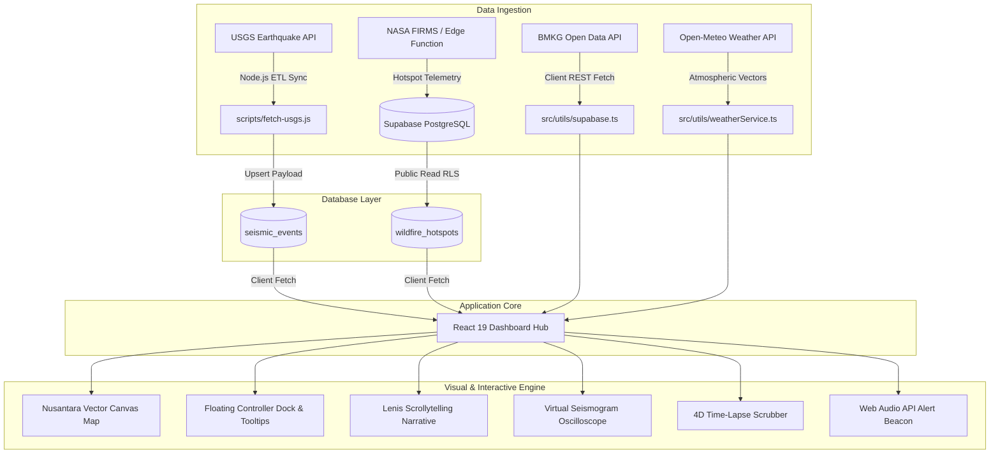

<div align="center">

# 🌍 Indonesian Crustal Observatory & Global Seismic Tracker
### *Nusantara Seismic Telemetry & Interactive Multi-Hazard Planetary Observatory*

[](https://react.dev/)
[](https://www.typescriptlang.org/)
[](https://developer.mozilla.org/en-US/docs/Web/API/Canvas_API)
[](https://vitejs.dev/)
[](https://tailwindcss.com/)
[](https://supabase.com/)
[](#-license)

<br />

<p align="center">
  A high-performance, research-grade planetary hazard monitoring observatory. Combines high-precision 2D Canvas vector cartography, live USGS and BMKG earthquake telemetry, NASA FIRMS active wildfire hotspots, 4D time-lapse chronos, virtual seismogram oscilloscope, and scrollytelling data journalism across all device viewports.
</p>

</div>

---

## 🧭 Overview

**Indonesian Crustal Observatory / Global Seismic Tracker** transforms multi-source geoscientific telemetry into an intuitive, high-fidelity interactive web observatory. Built with **React 19**, **HTML5 Canvas 2D Vector Cartography**, and **Supabase (PostgreSQL)**, the system visualizes planetary crustal dynamics with scientific precision:

- **High-Precision Nusantara Vector Map:** Sub-millimeter architectural 2D canvas cartography mapping the Indonesian archipelago, equatorial parallels, and Sunda Megathrust subduction trench lines with kinetic momentum panning, wheel zoom, and multi-touch pinch-to-zoom.
- **Seismic Telemetry:** Real-time USGS and BMKG feeds with hypocenter depth color coding, sonar shockwave ripples, and collision-free event tags.
- **NASA FIRMS Wildfire Hotspots:** Active thermal anomalies from VIIRS/MODIS satellites displaying Fire Radiative Power (MW) and atmospheric wind drift vectors.
- **Scrollytelling Journalism:** Algorithmic narrative chapters guided by smooth inertial scrolling (Lenis) and dynamic telemetry analytics.
- **Tactical Observatory Tools:** Virtual seismogram oscilloscope, official BMKG shakemaps, 7-day 4D time-lapse replay, synthesized Web Audio beacon alerts, and emergency broadcast social infographic generation.

---

## ✨ Key Features

### 🗺️ 1. High-Performance Nusantara Vector Map
- **Architectural Planar Vector Cartography:** Canvas 2D rendering engine projecting high-resolution GeoJSON landmasses of Indonesia and surrounding territories at a stable 60 FPS.
- **Sunda Megathrust Subduction Trench:** Crisp vector line mapping the tectonic subduction interface where the Indo-Australian and Eurasian plates collide.
- **Smooth Inertial Navigation:** Kinetic momentum dragging, mouse wheel zoom, double-click focus, and multi-touch pinch-to-zoom for tablet and mobile devices.

### 🌋 2. Dual-Hazard Telemetry (Seismic + Thermal Anomalies)
- **Real-Time Earthquake Feeds:** Automated USGS ingestion pipeline coupled with live Indonesian BMKG AutoGempa telemetry.
- **NASA FIRMS Wildfire Integration:** Active thermal hotspots from VIIRS/MODIS satellites displaying Fire Radiative Power (MW) and regional island categorization (Sumatra, Kalimantan, Sulawesi, Papua, Java).
- **Hazard Mode Toggle:** Switch seamlessly between **Dual Hazard**, **Seismic Only**, or **Wildfire Only** visualization modes.
- **Atmospheric Dispersion Context:** Integrated regional wind speed and vector direction powered by Open-Meteo.

### 🇮🇩 3. BMKG AutoGempa & Shakemap Visualizer
- Direct integration with Indonesia's Meteorology, Climatological, and Geophysical Agency (BMKG).
- Detailed **BMKG Shakemap Modal** rendering official shakemaps, Modified Mercalli Intensity (MMI) felt scales, hypocenter depth, coordinates, and tsunami potential warnings.

### 📜 4. Scrollytelling & Dynamic Narrative Rail
- **Lenis Smooth Scroll:** Hardware-accelerated smooth scrolling transitioning seamlessly from the Hero display into in-depth data journalism chapters.
- **Algorithmic Chapter Analytics:** Dynamic clustering engine (`storyAnalytics.ts`) automatically detecting high-magnitude swarms, megathrust strain, and deep mantle subduction events.
- **Story Progress Rail:** Visual chapter indicator tracking reading progress and synchronizing map view coordinates with each region under investigation.

### ⏱️ 5. 4D Time-Lapse Seismic Chrono-Scrubber
- 7-day chronological playback simulator with scrub bar and interactive play/pause controls.
- Dynamic speed multipliers (**1x**, **5x**, **15x**, **45x**) allowing researchers to observe foreshock and aftershock sequences over time.

### 📈 6. Virtual Seismogram Oscilloscope
- Interactive synthetic waveform generator simulating real-time seismometer recording.
- Models **P-waves** (primary compressional), **S-waves** (secondary shear), and large-amplitude **Surface waves** based on calculated distance, focal depth, and Richter magnitude.

### 🚨 7. Audio Beacon Alerts & Social Emergency Infographics
- **Synthesized Audio Beacon:** Web Audio API oscillator triggering frequency-tuned sonic pings on critical seismic events (M ≥ 5.5).
- **Toast Notifications:** Live alert toasts alerting users to incoming events with epicenter coordinates and magnitude badges.
- **Disaster Infographic Generator:** One-click modal generating formatted emergency broadcast visual cards with QR codes and vital parameters for public safety broadcasting.

### 📑 8. Research Bookmarks & Field Notes
- Save significant seismic occurrences with custom observation notes.
- Persistent local storage (`localStorage`) cache with full slide-over drawer management.
- One-click outbound links to official USGS Executive Event Portals and BMKG bulletins.

---

## 🛠️ Architecture & Data Pipeline



### Core Technologies
| Layer | Technology | Purpose |
|---|---|---|
| **Frontend Core** | React 19 + TypeScript | High-performance reactive UI with strict type safety |
| **Cartography & Rendering** | HTML5 Canvas 2D Vector Engine | Hardware-accelerated 60 FPS planar map projection, subduction lines, and thermal vectors |
| **Motion & Smooth Scroll** | Lenis + Framer Motion + GSAP | Inertial scrollytelling and UI micro-animations |
| **Styling** | Tailwind CSS v4 | Cutting-edge utility-first styling and frosted liquid-glass aesthetics |
| **Icons** | Lucide React | Minimalist scientific iconography |
| **Backend & Database** | Supabase (PostgreSQL 15+) | Managed database storing deduplicated seismic and wildfire records |
| **External APIs** | USGS, BMKG, NASA FIRMS, Open-Meteo | Multi-hazard scientific telemetry sources |

---

## 🚀 Getting Started

### Prerequisites
- **Node.js**: v18.0.0 or higher
- **npm**, **pnpm**, or **yarn**
- A **[Supabase](https://supabase.com/)** project

---

### 1. Clone the Repository
```bash
git clone https://github.com/FerrelHD/Global-Seismic-Tracker.git
cd Global-Seismic-Tracker
```

### 2. Install Dependencies
```bash
npm install
```

### 3. Setup Supabase Database Schema

Run the migration scripts located in `supabase/migrations/` inside your **Supabase SQL Editor**:

#### A. Seismic Events Table
```sql
create table if not exists public.seismic_events (
  id uuid default gen_random_uuid() primary key,
  usgs_id text unique not null,
  magnitude double precision,
  place text,
  depth double precision not null,
  latitude double precision not null,
  longitude double precision not null,
  occurred_at timestamptz not null,
  raw_data jsonb,
  created_at timestamptz default now()
);

-- Indices for performance
create index if not exists idx_seismic_occurred_at on public.seismic_events(occurred_at desc);
create index if not exists idx_seismic_magnitude on public.seismic_events(magnitude desc);
create index if not exists idx_seismic_usgs_id on public.seismic_events(usgs_id);

-- Enable RLS and public read
alter table public.seismic_events enable row level security;
create policy "Allow anonymous read access" on public.seismic_events
  for select using (true);
```

#### B. Wildfire Hotspots Table (NASA FIRMS)
```sql
create table if not exists public.wildfire_hotspots (
  id uuid default gen_random_uuid() primary key,
  latitude double precision not null,
  longitude double precision not null,
  frp double precision not null default 10.0,
  confidence varchar(20) not null default 'nominal',
  island varchar(50) not null,
  satellite varchar(20) not null default 'VIIRS',
  detected_at timestamptz not null default now(),
  created_at timestamptz not null default now()
);

-- Indices for spatial & time queries
create index if not exists idx_wildfire_lat_lon on public.wildfire_hotspots (latitude, longitude);
create index if not exists idx_wildfire_detected_at on public.wildfire_hotspots (detected_at desc);
create index if not exists idx_wildfire_island on public.wildfire_hotspots (island);

-- Enable RLS and public read
alter table public.wildfire_hotspots enable row level security;
create policy "Allow public read access to wildfire_hotspots"
  on public.wildfire_hotspots
  for select using (true);
```

---

### 4. Configure Environment Variables

Create a `.env` file in the project root based on `.env.example`:

```bash
cp .env.example .env
```

Configure your Supabase credentials:

```env
# Client-side Supabase keys (Settings -> API)
VITE_SUPABASE_URL=https://your-project-ref.supabase.co
VITE_SUPABASE_ANON_KEY=your-anon-key-here

# Background sync script keys (Service Role):
SUPABASE_URL=https://your-project-ref.supabase.co
SUPABASE_SERVICE_ROLE_KEY=your-service-role-key-here
```

---

### 5. Ingest Real-Time Earthquake Telemetry

Fetch the latest worldwide earthquakes from the USGS feed into your Supabase database:

```bash
npm run sync
```

Verify your database connection and record counts:

```bash
npm run verify
```

---

### 6. Start the Local Development Server

```bash
npm run dev
```

Open [http://localhost:3000](http://localhost:3000) in your browser.

---

## 📜 Available NPM Scripts

| Command | Action |
|---|---|
| `npm run dev` | Launches the Vite development server with Hot Module Replacement |
| `npm run build` | Compiles TypeScript and packages optimized production bundle into `dist/` |
| `npm run preview` | Locally previews the generated production bundle |
| `npm run sync` | Runs `scripts/fetch-usgs.js` to ingest real-time USGS telemetry to Supabase |
| `npm run verify` | Verifies database connectivity, row counts, and latest seismic records |
| `npm run test:etl` | Tests local USGS API response parsing without writing to the database |

---

## 📂 Project Structure

```
Global-Seismic-Tracker/
├── public/                     # Static assets
├── scripts/                    # Node.js ETL pipelines & maintenance
│   ├── fetch-usgs.js           # Live USGS API ingestion to Supabase
│   ├── verify-db.js            # DB connection and telemetry healthcheck
│   ├── test-etl-local.js       # Offline data pipeline tester
│   └── generate-land-dots.js   # Coordinate generation utility
├── supabase/
│   ├── functions/
│   │   └── firms-live/         # Supabase Edge Function for live FIRMS hotspot sync
│   └── migrations/             # SQL schema migrations (seismic & wildfires)
├── src/
│   ├── components/
│   │   ├── hero/               # Hero landing section
│   │   │   └── HeroSection.tsx
│   │   ├── story/              # Scrollytelling story cards & progress rail
│   │   │   ├── StoryChapterCard.tsx
│   │   │   └── StoryProgressRail.tsx
│   │   └── ui/                 # Observatory HUD & tactical control widgets
│   │       ├── BMKGShakemapModal.tsx      # BMKG official shakemap viewer
│   │       ├── BookmarkDrawer.tsx         # Saved bookmarks slide-over drawer
│   │       ├── CurtainLoader.tsx          # Cinematic opening curtain transition
│   │       ├── EpicenterMapCard.tsx       # Detail map card with regional view
│   │       ├── EventModal.tsx             # Detail inspection modal
│   │       ├── EventsListDrawer.tsx       # Live seismic events telemetry feed
│   │       ├── FloatingControllerDock.tsx # Floating bottom navigation dock
│   │       ├── liquid-glass.tsx           # Frosted glassmorphism card component
│   │       ├── SeismicAlertToast.tsx      # Live earthquake alert toast banner
│   │       ├── SocialInfographicModal.tsx # Emergency disaster broadcast infographic
│   │       ├── TimeLapseScrubber.tsx      # 4D 7-day chronological replay scrubber
│   │       ├── VectorGlobe.tsx            # Main interactive vector map with pinch/zoom/pan
│   │       ├── ViewportTechnicalFrame.tsx # Observatory viewport HUD frame
│   │       └── VirtualSeismogram.tsx      # Synthetic P/S/Surface wave oscilloscope
│   ├── hooks/
│   │   └── useLenis.ts         # Smooth scroll lifecycle hook
│   ├── types/
│   │   └── seismic.ts          # TypeScript models (SeismicEvent, WildfireHotspot, etc.)
│   ├── utils/
│   │   ├── audioAlert.ts       # Web Audio API synthesized alert sound
│   │   ├── firmsService.ts     # NASA FIRMS hotspot data fetcher
│   │   ├── storyAnalytics.ts   # Algorithmic clustering & chapter generation
│   │   ├── supabase.ts         # Supabase client, BMKG loader & bookmarks
│   │   └── weatherService.ts   # Open-Meteo wind & atmospheric data provider
│   ├── App.tsx                 # Main dashboard layout, state & scrollytelling coordinator
│   ├── index.css               # Global theme tokens, typography, and HUD styling
│   └── main.tsx                # React DOM entry point
├── .env.example                # Environment variables template
├── package.json                # Project dependencies and scripts
├── tsconfig.json               # TypeScript configuration
└── vite.config.ts              # Vite bundler configuration
```

---

## 🌐 Deployment

The application builds into pure static assets (`dist/`) and can be deployed directly to modern static hosting services:

### Vercel
```bash
npm install -g vercel
vercel
```
*Ensure you configure `VITE_SUPABASE_URL` and `VITE_SUPABASE_ANON_KEY` in your Vercel Project Settings.*

### Netlify
1. Connect your repository to Netlify.
2. Set Build Command: `npm run build`
3. Set Publish Directory: `dist`
4. Define your environment variables under **Site Configuration > Environment Variables**.

---

## 🤝 Data Attribution & References

- **[USGS Earthquake Hazards Program](https://earthquake.usgs.gov/)** for real-time global seismic feeds.
- **[BMKG Indonesia (Badan Meteorologi, Klimatologi, dan Geofisika)](https://data.bmkg.go.id/)** for real-time Indonesian AutoGempa bulletins and official shakemaps.
- **[NASA FIRMS (Fire Information for Resource Management System)](https://firms.modaps.eosdis.nasa.gov/)** for active VIIRS/MODIS thermal and wildfire hotspots.
- **[Open-Meteo API](https://open-meteo.com/)** for high-resolution regional wind and atmospheric dispersion metrics.
- **Typography:** [Cabinet Grotesk](https://www.fontshare.com/) & [JetBrains Mono](https://www.jetbrains.com/lp/mono/).

---

## 📄 License

This project is created as a **Personal Portfolio & Technical Showcase Project**. All rights reserved. Code is provided for review, evaluation, and demonstration purposes.
