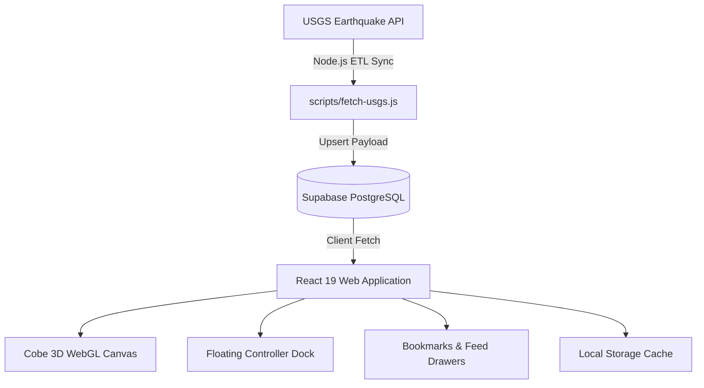

<div align="center">

# 🌍 Global Seismic Tracker

### *Interactive 3D WebGL Seismic Observatory & Real-Time Earthquake Intelligence*

[](https://react.dev/)
[](https://www.typescriptlang.org/)
[](https://vitejs.dev/)
[](https://tailwindcss.com/)
[](#-license)

<br />

<p align="center">
  A state-of-the-art seismic monitoring dashboard featuring a 3D WebGL globe with physics-based inertia, live USGS telemetry synchronization, frosted liquid-glass aesthetics, and interactive event inspection.
</p>

</div>

---

## 🧭 Overview

**Global Seismic Tracker** transforms raw planetary seismic data into an intuitive, high-fidelity 3D experience. Powered by **Cobe WebGL**, **React 19**, and **Supabase**, this observatory visualizes real-time and historical seismic events with scientific depth-based color coding, expanding shockwave ripples for major earthquakes, and collision-free floating callout badges.

---

## ✨ Key Features

- **🌐 Interactive 3D Cobe Globe**
  - Ultra-high-density 19,000-point dot-matrix projection.
  - Natural drag-to-rotate with momentum inertia, wheel zoom, and automated orbital sweep.
  - Smooth camera interpolation (`targetFocus`) when selecting regions or specific events.

- **⚡ Real-Time USGS Pipeline (ETL)**
  - Automated ingestion script syncing real-time earthquake feeds from the **United States Geological Survey (USGS)**.
  - Deduplication engine based on unique `usgs_id` with ISO timestamps, coordinates, depth, and magnitude.

- **🎨 Awwwards-Inspired Liquid Glass UI**
  - Frosted crystalline acrylic glass cards with hardware-accelerated backdrops (`backdrop-filter`).
  - Specular rim light reflections and micro-bevel borders.
  - Minimalist scientific observatory design system with clean JetBrains Mono and Cabinet Grotesk typography.

- **🔬 Scientific Color Classification**
  - **Shallow (< 30 km):** Neon Cyan `[#00D9FF]`
  - **Intermediate (30 – 100 km):** Scientific Blue `[#2563EB]`
  - **Deep (> 100 km):** Ultraviolet Purple `[#8B5CF6]`
  - **High Magnitude (M ≥ 5.8):** Pulsing Sonar shockwave rings radiating from the epicenter.

- **🏷️ Smart Label Occlusion Engine**
  - Mathematical 3D-to-2D projection mapping matching Cobe's GLSL camera coordinate space.
  - Distance-based anti-collision system ensuring tags never overlap on screen.
  - Zero-re-render raycasting for instant hover tooltips.

- **📑 Research Bookmarks & Field Notes**
  - Bookmark critical seismic events with custom observation notes.
  - Fast local storage persistence (`localStorage`) with sliding drawer management.
  - One-click direct link to official USGS Executive Event Portals.

- **📱 Fully Responsive Design**
  - Fluid navbar with adaptive breakpoints (desktop telemetry, tablet view, compact mobile header).
  - Horizontally swipeable bottom controller dock with preset region buttons (`GLOBAL`, `IDN`, `JPN`, `USA`).

---

## 🛠️ Architecture & Tech Stack



### Core Technologies
| Component | Technology | Description |
|---|---|---|
| **Frontend Framework** | React 19 + TypeScript | High-performance UI rendering with full type safety |
| **Bundler & Tooling** | Vite 8 | Instant HMR and optimized production build |
| **Styling & Design** | Tailwind CSS v4 | Utility-first CSS with custom CSS variables and glassmorphism |
| **3D Globe Engine** | Cobe (`cobe`) | 5kB WebGL globe library with 19,000 points and GLSL shader rendering |
| **Icons** | Lucide React | Clean, minimalist SVG iconography |
| **Database & Backend** | Supabase (PostgreSQL) | Managed database storing deduplicated seismic records |

---

## 🚀 Getting Started

### Prerequisites
- **Node.js**: v18.0.0 or higher
- **npm** or **pnpm** or **yarn**
- A free **[Supabase](https://supabase.com/)** project

---

### 1. Clone the Repository
```bash
git clone https://github.com/FerrelHD/Global-Seismic-Tracker.git
cd Global-Seismic-Tracker
```

### 2. Install Dependencies
```bash
npm install
```

### 3. Setup Supabase Database

Create a table named `seismic_events` in your Supabase SQL Editor:

```sql
create table if not exists public.seismic_events (
  id uuid default gen_random_uuid() primary key,
  usgs_id text unique not null,
  magnitude double precision,
  place text,
  depth double precision not null,
  latitude double precision not null,
  longitude double precision not null,
  occurred_at timestamptz not null,
  raw_data jsonb,
  created_at timestamptz default now()
);

-- Recommended Indexes for Fast Geospatial & Time Queries
create index if not exists idx_seismic_occurred_at on public.seismic_events(occurred_at desc);
create index if not exists idx_seismic_magnitude on public.seismic_events(magnitude desc);
create index if not exists idx_seismic_usgs_id on public.seismic_events(usgs_id);

-- Enable Read-Only Public Access (Row Level Security)
alter table public.seismic_events enable row level security;
create policy "Allow anonymous read access" on public.seismic_events
  for select using (true);
```

---

### 4. Configure Environment Variables

Create a `.env` file in the root directory (copy from `.env.example`):

```bash
cp .env.example .env
```

Fill in your Supabase project credentials:

```env
# Supabase Project Credentials (Settings -> API)
VITE_SUPABASE_URL=https://your-project-ref.supabase.co
VITE_SUPABASE_ANON_KEY=your-supabase-anon-key-here

# For background sync scripts (service role):
SUPABASE_URL=https://your-project-ref.supabase.co
SUPABASE_SERVICE_ROLE_KEY=your-supabase-service-role-key-here
```

---

### 5. Ingest Real-Time Earthquake Data

Run the automated ingestion script to fetch recent worldwide earthquake events from the USGS feed into your Supabase database:

```bash
npm run sync
```

Verify your database populated correctly:

```bash
npm run verify
```

---

### 6. Start the Development Server

```bash
npm run dev
```

Open [http://localhost:3000](http://localhost:3000) (or the port displayed in your terminal) in your browser.

---

## 📜 Available NPM Scripts

| Command | Action |
|---|---|
| `npm run dev` | Starts the Vite development server with Hot Module Replacement |
| `npm run build` | Compiles TypeScript and creates optimized production bundle in `dist/` |
| `npm run preview` | Locally previews the production build |
| `npm run sync` | Fetches latest seismic activity from USGS and updates Supabase |
| `npm run verify` | Inspects database count and latest recorded earthquake telemetry |
| `npm run test:etl` | Tests local USGS parsing without writing to database |

---

## 📂 Project Structure

```
Global-Seismic-Tracker/
├── public/                     # Static assets
├── scripts/                    # Node.js ETL & database maintenance scripts
│   ├── fetch-usgs.js           # Live USGS API ingestion to Supabase
│   ├── verify-db.js            # DB connection and telemetry healthcheck
│   ├── test-etl-local.js       # Offline data pipeline tester
│   └── generate-land-dots.js   # Coordinate generation utility
├── src/
│   ├── components/
│   │   └── ui/
│   │       ├── BookmarkDrawer.tsx         # Saved bookmarks slide-over drawer
│   │       ├── CobeGlobe.tsx              # 3D Cobe WebGL canvas with physics & labels
│   │       ├── EventModal.tsx             # Detail modal with hypocenter depth & USGS portal link
│   │       ├── EventsListDrawer.tsx       # Live seismic events list feed
│   │       ├── FloatingControllerDock.tsx # Bottom dock (region, depth, horizon filters)
│   │       └── liquid-glass.tsx           # Reusable frosted glassmorphic card component
│   ├── types/
│   │   └── seismic.ts          # TypeScript interfaces for SeismicEvent & Bookmark
│   ├── utils/
│   │   └── supabase.ts         # Supabase client & local bookmark helpers
│   ├── App.tsx                 # Main application dashboard layout & state hub
│   ├── index.css               # Global theme tokens, fonts, and HUD grid styles
│   └── main.tsx                # React DOM root mounting
├── .env.example                # Example environment variables template
├── package.json                # Project dependencies and npm scripts
├── tsconfig.json               # TypeScript compiler options
└── vite.config.ts              # Vite configuration
```

---

## 🌐 Deployment

The project builds static assets into `dist/` and can be deployed seamlessly to any static hosting provider:

### Vercel
```bash
npm install -g vercel
vercel
```
*Make sure to configure `VITE_SUPABASE_URL` and `VITE_SUPABASE_ANON_KEY` in your Vercel Project Environment Variables.*

### Netlify
1. Connect your GitHub repository.
2. Build command: `npm run build`
3. Publish directory: `dist`
4. Set the environment variables in Netlify site settings.

---

## 🤝 Data Attribution & Credits

- **[USGS Earthquake Hazards Program](https://earthquake.usgs.gov/)** for providing real-time seismic feeds.
- **[Cobe](https://github.com/shuding/cobe)** by Shu Ding for the 5kB WebGL globe library.
- **[Supabase](https://supabase.com/)** for backend database hosting.
- **[Cabinet Grotesk](https://www.fontshare.com/)** & **[JetBrains Mono](https://www.jetbrains.com/lp/mono/)** for typography.

---

## 📄 License

This project is created as a **Personal Portfolio & Showcase Project**. All rights reserved. Code is provided for review, evaluation, and demonstration purposes.
